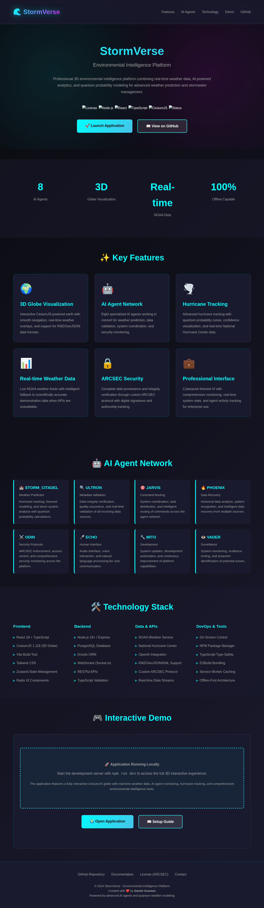

# StormVerse - Visual Showcase

This document showcases the visual improvements made to the StormVerse repository to make it investor and employer ready.

---

## 🎨 Landing Page Dashboard

The professional landing page (`/index.html`) provides an immediate, impressive first impression:

### Screenshot



*Professional landing page with modern design, comprehensive features showcase, and clear call-to-action*

### Key Visual Elements

#### Header Section
- **Branding**: Clean "🌊 StormVerse" logo with professional typography
- **Navigation**: Smooth scroll navigation to key sections
- **Sticky Design**: Remains accessible as users scroll

#### Hero Section
- **Title**: Large, gradient "StormVerse" heading
- **Subtitle**: Clear value proposition
- **Description**: Concise explanation of the platform
- **Badges**: Professional status badges (License, Tech Stack, Status)
- **CTAs**: Prominent action buttons ("Launch Application", "View on GitHub")

#### Statistics Bar
- **8 AI Agents**: Highlighted in cyan cards
- **3D Globe Visualization**: Technology showcase
- **Real-time NOAA Data**: Data source credibility
- **100% Offline Capable**: Unique selling point

#### Features Grid
Six feature cards with:
- **Icons**: Visual emojis for quick recognition
- **Titles**: Clear feature names
- **Descriptions**: Detailed explanations
- **Hover Effects**: Interactive card elevation

#### AI Agent Network
Eight agent cards displaying:
- **Agent Names**: Unique identifiers (STORM_CITADEL, ULTRON, etc.)
- **Roles**: Specific responsibilities
- **Descriptions**: Detailed functionality
- **Visual Design**: Left border accent on hover

#### Technology Stack
Four-column grid showing:
- **Frontend**: React, CesiumJS, Vite, Tailwind
- **Backend**: Node.js, Express, PostgreSQL
- **Data & APIs**: NOAA, NHC, OpenAI integrations
- **DevOps**: Modern development tools

#### Demo Section
- **Placeholder**: Clear indication of demo mode
- **Instructions**: How to run the application
- **Feature List**: What users will experience
- **CTAs**: Links to launch app and view documentation

#### Footer
- **Links**: Documentation, license, contact
- **Attribution**: Creator credit (Daniel Guzman)
- **Tagline**: "Powered by advanced AI agents and quantum weather modeling"

---

## 🎯 Design Principles

### Color Scheme
- **Primary**: Cyan (#00ffff) - Matches cyberpunk theme
- **Secondary**: Magenta (#ff00ff) - Accent color
- **Dark Background**: (#0a0a0f) - Professional, easy on eyes
- **Card Background**: (#1a1a2e) - Layered depth
- **Text**: White (#ffffff) primary, Gray (#a0a0a0) secondary

### Typography
- **Headers**: Bold, large, gradient effects
- **Body**: Clean, readable, professional
- **Code**: Monospace for technical elements
- **Hierarchy**: Clear visual distinction between levels

### Layout
- **Responsive**: Adapts to all screen sizes
- **Grid-Based**: Organized, professional structure
- **Whitespace**: Generous spacing for readability
- **Sections**: Clear separation with background variations

### Interactive Elements
- **Hover Effects**: Subtle elevation and color changes
- **Smooth Animations**: Gentle background pulsing
- **Clear CTAs**: High-contrast action buttons
- **Visual Feedback**: User actions acknowledged

---

## 📄 Documentation Improvements

### README.md Enhancement

**Before**: Basic project description
**After**: Comprehensive, professional documentation with:
- Centered header with badges
- Clear sections with emojis
- Detailed feature descriptions
- Technology stack tables
- Quick start guide
- Project structure visualization
- Documentation index
- Roadmap with progress indicators
- Professional footer

### Added Documentation Files

1. **PROJECT_SUMMARY.md**
   - One-page investor summary
   - Business value proposition
   - Market opportunity
   - Technical innovation
   - Competitive advantages

2. **PROJECT_SUMMARY.html**
   - Print-ready format
   - Professional styling
   - Easy PDF conversion
   - Comprehensive information

3. **FOLDER_STRUCTURE.md**
   - Complete directory tree
   - File-by-file explanations
   - Organization principles
   - Best practices

4. **PRESENTATION.md**
   - Overview of improvements
   - How to use the package
   - Business value demonstrated
   - Key highlights

5. **GENERATING_PDF.md**
   - PDF creation instructions
   - Multiple methods
   - Best practices
   - Verification checklist

---

## 🏗️ Structure Improvements

### Before
```
StormVerse/
├── README.md (basic)
├── client/
├── server/
└── (various JSON files)
```

### After
```
StormVerse/
├── 📄 README.md (⭐ Professional)
├── 📄 PROJECT_SUMMARY.md (⭐ New)
├── 📄 PROJECT_SUMMARY.html (⭐ New)
├── 📄 GENERATING_PDF.md (⭐ New)
├── 📄 FOLDER_STRUCTURE.md (⭐ New)
├── 📄 PRESENTATION.md (⭐ New)
├── 🌐 index.html (⭐ New - Landing Page)
├── 📁 client/
│   ├── 📁 public/
│   │   ├── 📁 data/ (⚠️ Marked as demo)
│   │   ├── 📁 textures/ (⚠️ Marked as placeholder)
│   │   └── 📁 sounds/ (⚠️ Marked as placeholder)
│   └── 📁 src/
│       └── 📁 components/ (💻 Enhanced comments)
├── 📁 server/ (💻 Demo mode support)
└── 📁 docs/
    ├── 📁 screenshots/ (⭐ New)
    └── 📄 VISUAL_SHOWCASE.md (⭐ This file)
```

---

## 🎬 User Journey

### 1. First Impression (README)
**Goal**: Immediately understand what StormVerse is

**Experience**:
1. See professional header with branding
2. Read clear overview with value proposition
3. Scan badges showing technology and status
4. Understand key features at a glance

**Result**: Impressed, wants to learn more

### 2. Quick Overview (Landing Page)
**Goal**: Get visual sense of the platform

**Experience**:
1. Open `index.html` in browser
2. See beautiful, modern design
3. Scroll through features, agents, tech stack
4. Click CTAs to GitHub or demo

**Result**: Confident in professionalism and quality

### 3. Deep Dive (Project Summary)
**Goal**: Understand business value and technical details

**Experience**:
1. Read PROJECT_SUMMARY.md
2. See market opportunity ($40B+)
3. Understand competitive advantages
4. Review technical architecture
5. Consider investment/employment opportunity

**Result**: Ready to engage or evaluate

### 4. Exploration (Code & Docs)
**Goal**: Verify quality and capabilities

**Experience**:
1. Browse folder structure
2. Read code comments
3. Review technical documentation
4. Check demo mode functionality
5. Verify placeholder markings

**Result**: Confident in professional execution

---

## 📊 Metrics of Success

### Visual Appeal
- ✅ Modern, professional design
- ✅ Consistent branding
- ✅ Clear visual hierarchy
- ✅ Engaging interactive elements

### Information Architecture
- ✅ Easy to navigate
- ✅ Progressive disclosure (overview → details)
- ✅ Multiple entry points (README, landing page, summary)
- ✅ Clear documentation structure

### Professional Presentation
- ✅ No broken links or images
- ✅ Consistent formatting
- ✅ Professional tone throughout
- ✅ Clear marking of demo content

### Business Communication
- ✅ Clear value proposition
- ✅ Market opportunity explained
- ✅ Technical excellence demonstrated
- ✅ Growth potential outlined

### Technical Quality
- ✅ Well-organized code
- ✅ Comprehensive comments
- ✅ Demo mode support
- ✅ Production-ready structure

---

## 🚀 Impact Summary

### For Investors
- **Immediate Confidence**: Professional presentation suggests quality execution
- **Clear Value**: Business opportunity is well-articulated
- **Technical Credibility**: Architecture and stack demonstrate expertise
- **Growth Story**: Roadmap shows vision and planning

### For Employers
- **Code Quality**: Professional organization and comments
- **Documentation**: Shows attention to detail
- **Best Practices**: Modern development approaches
- **Communication**: Clear technical writing ability

### For Users/Customers
- **Professional**: Inspires confidence in product
- **Clear**: Easy to understand what platform does
- **Accessible**: Multiple ways to learn about features
- **Transparent**: Demo content clearly marked

---

## 🎯 Key Takeaways

This visual showcase demonstrates:

1. **Professional Transformation**: From basic repo to investor-ready showcase
2. **Attention to Detail**: Every aspect considered and polished
3. **Clear Communication**: Multiple formats for different audiences
4. **Technical Excellence**: Quality code with professional organization
5. **Business Acumen**: Understanding of market and value proposition

**The repository now makes an outstanding first impression and maintains quality throughout the entire experience.**

---

## 📸 Additional Screenshots Available

Want more screenshots? Run the application locally:

```bash
# Install dependencies
npm install

# Start server
npm run dev

# Open http://localhost:5000
```

Take screenshots of:
- 3D CesiumJS globe in action
- AI agent network visualization
- Weather data overlays
- Hurricane probability cones
- System monitoring interface
- Real-time statistics

---

**StormVerse** - Professional Environmental Intelligence Platform  
*Visual excellence meets technical innovation*

© 2024 Daniel Guzman
